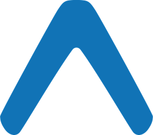

<h1 align="center" >
  
</h1>

<h1 align="center" >
  Projeto Agende.Me
</h1>

<h4 align="center" >
  Evite aglomerações,&nbsp;afaste-se do vírus!
</h4>

<p align="center">


 
</p>

<p align="center" >
  <a href="#mag-sobre-o-projeto" >Sobre o Projeto</a>&nbsp;&nbsp;&nbsp;|&nbsp;&nbsp;&nbsp;
  <a href="#open_book-esclarecimentos" >Esclarecimentos</a>&nbsp;&nbsp;&nbsp;|&nbsp;&nbsp;&nbsp;
  <a href="#gear-funcionamento" >Funcionamento</a>&nbsp;&nbsp;&nbsp;|&nbsp;&nbsp;&nbsp;
  <a href="#rocket-feito-com" >Feito com</a>&nbsp;&nbsp;&nbsp;|&nbsp;&nbsp;&nbsp;
  <a href="#information_source-como-executar" >Como executar</a>&nbsp;&nbsp;&nbsp;|&nbsp;&nbsp;&nbsp;
  <a href="#page_facing_up-licença" >Licença</a>
</p>


## :mag: Sobre o Projeto 
Esse projeto foi desenvolvido tecnicamante por **Ricardo Coutinho**:[linkedIn](https://www.linkedin.com/in/rcout1nho/)-[github](https://github.com/RCout1nho) e **Orlando Vandres**[linkedIn](www.linkedin.com/in/orlando-vandres)-[github](https://github.com/Vandrekad)
como uma solução para o hackaton [Pandemic Hackfest: Saúde](http://www.amazonhackfest.com/) do Ministério Público de Estado do Amazonas.

Os Designers responsáveis pelas interfaces foram **Nelson Fernandes**:[linkedIn](https://www.linkedin.com/in/nelsonffernandes/) , **Charlene Gualberto**-[linkedIn](https://www.linkedin.com/in/charlenegualberto)-[behance](https://www.behance.net/charleneny) e **Wesley Albuquerque**:[linkedIn](https://www.linkedin.com/in/wesley-hip%C3%B3lito-albuquerque-a03779135)-[Behance](https://www.behance.net/wesleyalbuque).

A equipe de Marketing é composta por **Rebeca Alves**-[linkedIn](https://www.linkedin.com/in/rebeca-alves-mendes-060990195/) e **Maria Giovanna**.


A equipe de Business é composta por **Guilherme Regueira**, **Gabriel Maciel**-[linkedIn](https://www.linkedin.com/in/gabriel-maciel2001/) e **Ryan Albuquerque**-[linkedIn](https://www.linkedin.com/in/ryan-albuquerque/)

O projeto tem o intuito de evitar que aglomerações em estabelecimentos de serviços essenciais, como supermercados e bancos, sejam causadas, de forma a evitar a proliferação do vírus do covid-19, mantendo a população em maior segurança.

No aplicativo, as empresas podem cadastrar a quantidade máxima de pessoas que podem permanecer simultaneamente em seu estabelecimento, já os usuários, podem consultar quais empresas estão disponíveis em determinado horário, e agendar uma "hora" para utilizá-lo, de forma a manter um fluxo organizado de pessoas que utilizam um determinado estabelecimento e evitar a formação de filas, que representam de certa forma um vetor para o corona vírus.

Para mais informações visite [nosso instagram](https://www.instagram.com/agende.me/?hl=pt-br) e assista o nosso [vídeo de pitch](https://www.youtube.com/watch?v=qpDs37Fbpyc).

## :open_book: Esclarecimentos

Hoje, 19 de abril de 2020, a versão beta do agendeMe foi lançada no github, possuindo apenas a interface do usuário e uma pequena parte da interface da empresa. Está planejado a implementação de diversas features e finalização oficial do app após o resultado do Pandemic Hackfest: Saúde, de forma a finalizá-lo totalmente, permitindo o deploy da API em um servidor como o **Heroku** ou **digitalOcean** e o deploy do app na PlayStore(Android) e posteriormente na AppStore(iOS).

Vale ressaltar que a API e a interface do usuário estão **100% funcionais** , permitindo funções como realizar login, cadastro, visualizar categorias, lugares, geolocalização, agendar um horário e gerar QR Code. Assim como, a leitura de QR Codes na opção de login como empresa também está sendo feita, porém ainda não possui integração com a API.

## :gear: Funcionamento

<h1 align="center" >
  
</h1>

## :rocket: Feito Com

<h1 align="center" >
  
  
  
</h1>

Esse projeto foi desenvolvido com as seguintes tecnologias:

<h4>Para o Backend</h4>

- [NodeJS](https://nodejs.org/)
- [MongoDB](https://www.mongodb.com/)
- [Mongoose](https://mongoosejs.com/)
- [Multer](https://www.npmjs.com/package/multer)
- [Express](https://expressjs.com/pt-br/)
- [Nodemon](https://nodemon.io/)
- [Cors](https://www.npmjs.com/package/cors)

<h4>Para o  Mobile</h4>

- [React Native](https://reactnative.dev/)
- [Expo](https://expo.io/)
- [React Navigation](https://reactnavigation.org/)
- [React Native Maps](https://github.com/react-native-community/react-native-maps)
- [Axios](https://github.com/axios/axios)
- [Expo-bar-code-scanner](https://docs.expo.io/versions/latest/sdk/bar-code-scanner/)
- [React-native-custom-qr-codes](https://www.npmjs.com/package/react-native-custom-qr-codes)
- [React-native-paper](https://callstack.github.io/react-native-paper/)
- [React-native-material-dropdown](https://www.npmjs.com/package/react-native-material-dropdown)
- [Styled Components](https://styled-components.com/)

## :information_source: Como executar
### Dependências necessárias
#### Para o mobile
Para executar essa aplicação é necessário que tenha todas das dependências do **React Native**, que podem ser instaladas seguindo [esse tutorial](https://react-native.rocketseat.dev/) e o [Expo](https://docs.expo.io/versions/latest/get-started/installation/) em sua máquina.

#### Para o backend
Para executar essa aplicação é necessário que tenha o [NodeJS](https://nodejs.org/en/download/) instalado na sua máquina.

### Executando o backend
  **1.** Clone esse repositório e instale as dependências de backend
  ```bash
  # clone o repositório
  git clone https://github.com/RCout1nho/Agende-Me.git

  # entre na pasta backend
  cd backend

  # instale as dependências do backend
  # com yarn
  yarn

  # com npm
  npm install
  ```
  **2.** Executar
  ```bash
  # com yarn
  yarn start

  # com npm
  npm start
  ```
  ***OBS:*** Por padrão o backend será executado na porta `3333` da sua máquina, ou seja, em `http://localhost:3333` ou `http://ip_local_da_sua_maquina:3333`, se por ventura essa porta estiver indisponível, siga os seguintes passos:
  
  **1.** Acesse a pasta src
  ```bash 
  cd backend/src
  ```

  **2.** Edite o arquivo `server.js` e altere o valor da seguinte constante:
  ```js
  const port = 3333; // altere para a porta desejada
  ```

  ### Executando o mobile
  **1.** Clone esse repositório (se já não o tiver clonado anteriormente) e instale as dependências de mobile:
  ```bash
  # clone o repositório
  git clone https://github.com/RCout1nho/Agende-Me.git

  # entre na pasta mobile
  cd mobile

  # instale as dependências do mobile
  # com yarn
  yarn

  # com npm
  npm install
  ```

  **2.** Edite o endereço IP da API:
  ```bash
    # Acesse o arquivo api.js
    cd mobile/src/services
  ```
  ```js
    // Altere o valor da constantes your_ip e port
    const your_ip = "http://192.168.0.10"; // seu ip local
    const port = 3333; // porta configurada no backend
  ```

  **3.** Executar
  ```bash
    # com yarn
    yarn start

    # com expo-cli
    expo start

    # com npm
    npm start  
  ```
  ***OBS:*** Para realizar login no app, um usuário de teste está cadastrado como os seguintes dados: `email:teste@teste.com e senha: teste123`, ou se preferir, crie um cadastro de usuário próprio ;).
  ***OBS:*** Lembre-se de manter o backend rodando quando utilizar o frontend, caso contrário, as solicitações à API não poderão ser efetivadas.

  #### Rodando em um emulador
  Após rodar a aplicação, o expo automaticamente abrirá uma página no seu navegador, selecione a opção *"Run on Android device/emulator"* , certifique-se se estar com o emulador rodando.

  #### Rodando em um dispositivo físico
  1. Baixe o aplicativo do expo na loja do seu SO;
  2. Entre no aplicativo do expo e escaneie o QR Code que foi gerado no seu terminal ou no browser;
  
  ***OBS:*** Para rodar em um dispositivo físico, certifique-se que tanto o smartphone quanto a máquina que está rodando a aplicação estejam na mesma rede WiFi.

  ## :page_facing_up: Licença
  Esse projeto está sob a licença MIT. Veja o arquivo [LICENSE](https://github.com/RCout1nho/Agende-Me/blob/master/LICENSE) para mais detalhes

  
